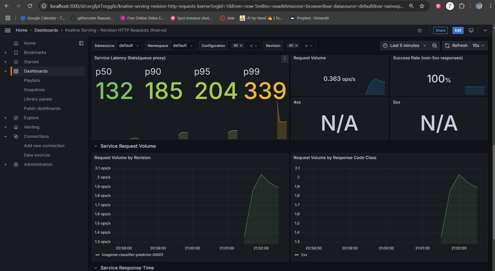

### EMLOV4-Session-17 Assignment - Canary Deployment

Deploy three imagenet Hugging face modes with AWS EKS service in canary deployment method with Serving tools like KServe, with deployment tools like argoCD and with monitoring tools like prometheus, grafana.

**Wait paitently see all deletion is successfull in aws cloud formation stack page and then close the system because some times
the deletion gets failed so at backend something would be running and it may cost you high**.

**If you are triggering a spot instance manually with `peresistent` type ensure that both the spot request is cancelled manually
and the AWS instance is terminated finally**

Note: This repo also has the procedure for [ArgoCD deployment repo](https://github.com/ajithvcoder/emlo4-session-17-ajithvcoder-canary-argocd-kserve) `https://github.com/ajithvcoder/emlo4-session-17-ajithvcoder-canary-argocd-kserve`

### Contents

- [Requirements](#requirements)
- [Development Method](#development-method)
    - [Installation](#installation)
    - [HF models and torchserve files setup](#hf-models-and-torchserve-files-setup)
    - [Cluster creation and configuration](#cluster-creation-and-configuration)
    - [ArgoCD and Canary Deployment](#argocd-and-canary-deployment)
    - [Deletion Procedure](#deletion-procedure)
- [Learnings](#learnings)
- [Results Screenshots](#results-screenshots)

### Requirements

- Deploy any 3 models (has to be imagenet classifiers) from huggingface
- Create a Repository with all the code, and deployment files, and argo app yaml files
- Use ArgoCD to connect your repo for automated deployment
- You will perform the below deployment step and run send.pyLinks to an external site. to add load to the model
- Perform Deployment Steps
    - 1st model with 1 replica
    - 2nd model with 30% traffic (canary candidate)
    - 2nd model with 100% traffic (promoted to production)
    - 2nd model with 2 replicas
    - 3rd model with 30% traffic (canary candidate)
    - 3rd model with 100% traffic
- During the deployments, make sure to use Grafana to see Traffic Metrics
    - Take screenshots during Canary Deployment of each step in deployment
        - Service Latency
        - Service Request Volume
        - Response Time by Revision
- What to Submit
    - Grafana Metrics Screenshots
    - Link to Github Repo (which is connected to ArgoCD)

### Installation

**AWS install**

```
curl "https://awscli.amazonaws.com/awscli-exe-linux-x86_64.zip" -o "awscliv2.zip"
unzip awscliv2.zip
sudo ./aws/install
```

**Provide credentials**

```
aws configure
```

**EKSCTL Install**

```
# for ARM systems, set ARCH to: `arm64`, `armv6` or `armv7`
ARCH=amd64
PLATFORM=$(uname -s)_$ARCH

curl -sLO "https://github.com/eksctl-io/eksctl/releases/latest/download/eksctl_$PLATFORM.tar.gz"

# (Optional) Verify checksum
curl -sL "<https://github.com/eksctl-io/eksctl/releases/latest/download/eksctl_checksums.txt>" | grep $PLATFORM | sha256sum --check

tar -xzf eksctl_$PLATFORM.tar.gz -C /tmp && rm eksctl_$PLATFORM.tar.gz

sudo mv /tmp/eksctl /usr/local/bin
```

**Set the default ssh-gen key in local**

This default ssh key is used by aws for default ssh login

```
ssh-keygen -t rsa -b 4096
```

**Install kubectl for aws eks in your local**

```
curl -O https://s3.us-west-2.amazonaws.com/amazon-eks/1.32.0/2024-12-20/bin/linux/amd64/kubectl

chmod +x ./kubectl

mkdir -p $HOME/bin && cp ./kubectl $HOME/bin/kubectl && export PATH=$HOME/bin:$PATH
```

### HF models and torchserve files setup

Three models from hugging face are downloaded and used as `imagenet-m1`, `imagenet-m2`, `imagenet-m3` 

- `facebook/deit-tiny-patch16-224`
- `facebook/deit-small-patch16-224`
- `WinKawaks/vit-tiny-patch16-224`

In `eks-setup` folder 
- run `python download_all.py`
- run `python create_mar.py`

Copy models to aws s3 `mybucket-emlo-mumbai/kserve-ig/` folder. 
Note: Folder name can change for everyone as it needs to be unique
- `aws configure`
- `aws s3 cp --recursive packaged-models s3://mybucket-emlo-mumbai/kserve-ig/`

Verify inside s3 if you can see all above files.

**Note:** All three config model name should be same here but folder names can be different, only then we can use the same url for canary deployment else it would cause 500 error.


### Cluster creation and configuration

Create Cluster

- `eksctl create cluster -f eks-cluster.yaml`

```
<debug>
Deletion
- `eksctl delete cluster -f eks-cluster.yaml --disable-nodegroup-eviction`
</debug>
```

Install metric server properly
- [Metric server installation follow this](https://medium.com/@cloudspinx/fix-error-metrics-api-not-available-in-kubernetes-aa10766e1c2f)

**KNative**

```
kubectl apply -f https://github.com/kubernetes-sigs/metrics-server/releases/latest/download/components.yaml
kubectl apply -f https://github.com/knative/serving/releases/download/knative-v1.16.0/serving-crds.yaml
kubectl apply -f https://github.com/knative/serving/releases/download/knative-v1.16.0/serving-core.yaml
```

**ISTIO** 

```
kubectl apply -f https://github.com/knative/net-istio/releases/download/knative-v1.16.0/istio.yaml
kubectl apply -f https://github.com/knative/net-istio/releases/download/knative-v1.16.0/net-istio.yaml
```

**Knative serving**

```
kubectl patch configmap/config-domain \
      --namespace knative-serving \
      --type merge \
      --patch '{"data":{"emlo.tsai":""}}'

kubectl apply -f https://github.com/knative/serving/releases/download/knative-v1.16.0/serving-hpa.yaml
kubectl apply -f https://github.com/cert-manager/cert-manager/releases/download/v1.16.2/cert-manager.yaml

# verify
kubectl get all -n cert-manager
```

Wait for cert manager pods to be ready

```
kubectl apply --server-side -f https://github.com/kserve/kserve/releases/download/v0.14.1/kserve.yaml
```

Wait for KServe Controller Manager to be ready

```
kubectl apply --server-side -f https://github.com/kserve/kserve/releases/download/v0.14.1/kserve.yaml
kubectl get all -n kserve

# Wait and check if all pods are running in kserve
kubectl apply --server-side -f https://github.com/kserve/kserve/releases/download/v0.14.1/kserve-cluster-resources.yaml
```

**S3 Setup**

Create S3 Service Account and Create IRSA for S3 Read Only Access
Note: These are already done in previous assignments i.e the policy creation here we are only attaching the policy

```
eksctl create iamserviceaccount \
--cluster=basic-cluster \
--name=s3-read-only \
--attach-policy-arn=arn:aws:iam::aws:policy/AmazonS3ReadOnlyAccess \
--override-existing-serviceaccounts \
--region ap-south-1 \
--approve
```

```
kubectl apply -f s3-secret.yaml
kubectl patch serviceaccount s3-read-only -p '{"secrets": [{"name": "s3-secret"}]}'
```

Test if `imagenet-classifier` works fine with all m1, m2 and m3 models

- `kubectl apply -f imagenet-classifier.yaml`


Check if everything works and delete it, we need to setup prometheus and grafana

- `python test_kserve_imagenet.py`

Ingress details

```
kubectl get isvc
kubectl get svc -n istio-system
````

Delete classifier after testing

- `kubectl delete -f imagenet-classifier.yaml`


**Prometheus**

```
git clone --branch release-0.14 https://github.com/kserve/kserve.git
cd kserve
kubectl apply -k docs/samples/metrics-and-monitoring/prometheus-operator
kubectl wait --for condition=established --timeout=120s crd/prometheuses.monitoring.coreos.com
kubectl wait --for condition=established --timeout=120s crd/servicemonitors.monitoring.coreos.com
kubectl apply -k docs/samples/metrics-and-monitoring/prometheus
```

```
kubectl patch configmaps -n knative-serving config-deployment --patch-file qpext_image_patch.yaml
```

Set max nodes because if you give more request and max is not set it may scale more

```
eksctl scale nodegroup --cluster=basic-cluster --nodes=6 ng-spot-3 --nodes-max=6
eksctl get nodegroup --cluster basic-cluster --region ap-south-1 --name ng-spot-3
```

```
kubectl port-forward service/prometheus-operated -n kfserving-monitoring 9090:9090
```

**Grafana**

```
kubectl create namespace grafana

helm repo add grafana https://grafana.github.io/helm-charts
helm repo update
helm install grafana grafana/grafana --namespace grafana --version 8.8.4
```

```
kubectl get secret --namespace grafana grafana -o jsonpath="{.data.admin-password}" | base64 --decode ; echo
kubectl port-forward svc/grafana 3000:80 -n grafana
```

Setup dashboard for grafana

- Go to Connections-> Add data source -> Prometheus -> Add this prometheus url `http://prometheus-operated.kfserving-monitoring.svc.cluster.local:9090` -> save and test

- Go to Dashboards -> New -> import -> download the json file from here `https://grafana.com/grafana/dashboards/18032-knative-serving-revision-http-requests/` -> upload the json to the specified place


verify

- `kubectl get isvc`

### ArgoCD and Canary Deployment

ArgoCD setup

- `kubectl create namespace argocd`
- `kubectl apply -n argocd -f https://raw.githubusercontent.com/argoproj/argo-cd/stable/manifests/install.yaml`

ArgoCD executable file setup

```
curl -sSL -o argocd-linux-amd64 https://github.com/argoproj/argo-cd/releases/latest/download/argocd-linux-amd64
sudo install -m 555 argocd-linux-amd64 /usr/local/bin/argocd
rm argocd-linux-amd64
```

Get Argocd password for login
- `argocd admin initial-password -n argocd`

Check if you are able to access the UI, in codespaces i am not able to forward and access for argocd UI but in local its working
- `kubectl port-forward svc/argocd-server -n argocd 8080:443`

**Argo CD deployment**

Note: I have used [canary-argocd-kserve-repo](https://github.com/ajithvcoder/emlo4-session-17-ajithvcoder-canary-argocd-kserve) repo for deployment of argoCD apps. Please refer to `https://github.com/ajithvcoder/emlo4-session-17-ajithvcoder-canary-argocd-kserve` for argocd repo structure

- Have s3-secret.yaml file in argo-apps/s3-secret.yaml folder and update it with your AWS credentails i.e `AWS_ACCESS_KEY_ID` and `AWS_SECRET_ACCESS_KEY`

```
apiVersion: v1
kind: Secret
metadata:
  name: s3creds
  annotations:
     serving.kserve.io/s3-endpoint: s3.ap-south-1.amazonaws.com # replace with your s3 endpoint e.g minio-service.kubeflow:9000
     serving.kserve.io/s3-usehttps: "1" # by default 1, if testing with minio you can set to 0
     serving.kserve.io/s3-region: "ap-south-1"
     serving.kserve.io/s3-useanoncredential: "false" # omitting this is the same as false, if true will ignore provided credential and use anonymous credentials
type: Opaque
stringData: # use `stringData` for raw credential string or `data` for base64 encoded string
  AWS_ACCESS_KEY_ID: AKXXXXXXXXXXXXXXXXXXXXX
  AWS_SECRET_ACCESS_KEY: "RQHBUNBSJNINQONUKNUKXXXXXX+XQIWOW"

---

apiVersion: v1
kind: ServiceAccount
metadata:
  name: s3-read-only
secrets:
- name: s3creds
```

- Create the repo before you start and update the repo url in `argo-apps/models.yaml` file

```
<debug>
Delete argocd deployments
kubectl get app -n argocd
kubectl patch app model-deployments  -p '{"metadata": {"finalizers": ["resources-finalizer.argocd.argoproj.io"]}}' --type merge -n argocd
kubectl delete app model-deployments -n argocd
</debug>
```

**Step 1: Deploy First argo app**

- Have only imagenet-classifer.yaml in model-deployments folder

Adjust only following parameters
```
    minReplicas: 1
    maxReplicas: 1
    containerConcurrency: 1
    # canaryTrafficPercent: 0
    ...
    storageUri: s3://mybucket-emlo-mumbai/kserve-ig/imagenet-m1/
    ...
```
- Commit with git message "deploy model m1"
- Git push and Go to argocd and check sync status by refershing
- Deploy argocd app - `kubectl apply -f argo-apps`
- Go to argocd and check sync status by refershing

Update your loadbalancer URL in `load_kserve_in.py` file. For sample test use `test_kserve_imagenet.py`

Do load test
- `python load_kserve_in.py -c 2`
- Check grafana dashboard

**Step 2: Deploy imagenet-m2 model with 30 percent traffic**

Adjust only following parameters in `imagenet-classifer.yaml`. Note: its not adding newly just replace the values in `minReplicas`, `maxReplicas`, `containerConcurrency`, `storageUri` and uncomment `canaryTrafficPercent`

```
    minReplicas: 2
    maxReplicas: 2
    containerConcurrency: 2
    canaryTrafficPercent: 30
    ...
    storageUri: s3://mybucket-emlo-mumbai/kserve-ig/imagenet-m2/
    ...
```

- Commit with git message "deploy model m2 with canary 30"
- Git push and Go to argocd and check sync status by refershing
- Click Sync in UI or do by cli
- Check `kubectl get isvc` percentage of canary and `kubectl get pods`
Do load test
- `python load_kserve_in.py -c 2`
- Check grafana dashboard

**Step 3: Promote imagenet-m2 to prod with 100 percent traffic**

Adjust only following parameters in `imagenet-classifer.yaml`. Note: its not adding newly just replace the values in `minReplicas`, `maxReplicas`, `containerConcurrency`, `storageUri`, `canaryTrafficPercent`

```
    minReplicas: 2
    maxReplicas: 2
    containerConcurrency: 2
    canaryTrafficPercent: 100
    ...
    storageUri: s3://mybucket-emlo-mumbai/kserve-ig/imagenet-m2/
    ...
```

- Commit with git message "promote model m2 to prod with canary 100"
- Git push and Go to argocd and check sync status by refershing
- Click Sync in UI or do by cli
- Check `kubectl get isvc` percentage of canary and `kubectl get pods`
Do load test
- `python load_kserve_in.py -c 2`
- Check grafana dashboard

**Step 4: Deploy imagenet-m3 model with 30 percent traffic**

Adjust only following parameters in `imagenet-classifer.yaml`. Note: its not adding newly just replace the values in `minReplicas`, `maxReplicas`, `containerConcurrency`, `storageUri`, `canaryTrafficPercent`

```
    minReplicas: 2
    maxReplicas: 2
    containerConcurrency: 2
    canaryTrafficPercent: 30
    ...
    storageUri: s3://mybucket-emlo-mumbai/kserve-ig/imagenet-m3/
    ...
```

- Commit with git message "deploy model m3 with canary 30"
- Git push and Go to argocd and check sync status by refershing
- Click Sync in UI or do by cli
- Check `kubectl get isvc` percentage of canary and `kubectl get pods`
Do load test
- `python load_kserve_in.py -c 2`
- Check grafana dashboard

**Step 5: Promote imagenet-m3 to prod with 100 percent traffic**

Adjust only following parameters in `imagenet-classifer.yaml`. Note: its not adding newly just replace the values in `minReplicas`, `maxReplicas`, `containerConcurrency`, `storageUri`, `canaryTrafficPercent`

```
    minReplicas: 2
    maxReplicas: 2
    containerConcurrency: 2
    canaryTrafficPercent: 100
    storageUri: s3://mybucket-emlo-mumbai/kserve-ig/imagenet-m3/
```

- Commit with git message "promote model m3 to prod with canary 100"
- Git push and Go to argocd and check sync status by refershing
- Click Sync in UI or do by cli
- Check `kubectl get isvc` percentage of canary and `kubectl get pods`
Do load test
- `python load_kserve_in.py -c 2`
- Check grafana dashboard

### Deletion Procedure

**Delete argocd deployments**

Verify app name
- `kubectl get app -n argocd`

Delete cascade
- `kubectl patch app model-deployments  -p '{"metadata": {"finalizers": ["resources-finalizer.argocd.argoproj.io"]}}' --type merge -n argocd`
- `kubectl delete app model-deployments -n argocd`

**Deletion of cluster**

- `eksctl delete cluster -f eks-cluster.yaml --disable-nodegroup-eviction`

**Wait paitently see all deletion is successfull in aws cloud formation stack page and then close the system because some times
the deletion gets failed so at backend something would be running and it may cost you high**

**If you are triggering a spot instance manually with `peresistent` type ensure that both the spot request is cancelled manually
and the AWS instance is terminated finally**


### Learnings

- Doing canary deployment with same model name by observing the traffic using argo cd with 100% `200 response`
- if you face `Should have a image_processor_type key in its preprocessor_config.json ` this error then there could be a space constraint also because when i used 2 nodes and tried to scale i faced this error.
- `model name not found` error can come if you are deploying canary deployments with different `model name`. it will send 30 percent to the new model and 70 percent to old model but when you load test you can do only to either of the one model as the model name is embbeded in the request url `http://a775a10130ee74cd49b37e0b4b585f9e-1718843569.ap-south-1.elb.amazonaws.com/v1/models/dog-classifier:predict`.

### Results Screenshots

Repo: [canary-argocd-kserve-repo](https://github.com/ajithvcoder/emlo4-session-17-ajithvcoder-canary-argocd-kserve) repo

**Step 1: Deploy First argo app**

ISTIO URL and inital pods


ArgoCD you can see the commit id in [canary-argocd-kserve-repo](https://github.com/ajithvcoder/emlo4-session-17-ajithvcoder-canary-argocd-kserve) repo and first version `xx0001 pod`


Load testing


Grafana Visuvalization of received request and the reponse times to pods/deployments




**Step 2: Deploy imagenet-m2 model with 30 percent traffic**

ISTIO URL and inital pods with 70 and 30 split


ArgoCD you can see the commit id in [canary-argocd-kserve-repo](https://github.com/ajithvcoder/emlo4-session-17-ajithvcoder-canary-argocd-kserve) repo and second version `xx0002 pod`


Load testing


Grafana Visuvalization of received request and the reponse times to pods/deployments. You can see that `xx002` has received only 30% of the request in `Request volume by Revision` panel


**Step 3: Promote imagenet-m2 to prod with 100 percent traffic**

ISTIO URL and inital pods with 100 traffic to `xx002` pod


ArgoCD you can see the commit id in [canary-argocd-kserve-repo](https://github.com/ajithvcoder/emlo4-session-17-ajithvcoder-canary-argocd-kserve) repo and second version `xx0002 pod`


Load testing


Grafana Visuvalization of received request and the reponse times to pods/deployments. You can see that `xx002` has received 100% of the request in `Request volume by Revision` panel and `xx0001` has received 0 request.


**Step 4: Deploy imagenet-m3 model with 30 percent traffic**

ISTIO URL and inital pods with 70 and 30 split


ArgoCD you can see the commit id in [canary-argocd-kserve-repo](https://github.com/ajithvcoder/emlo4-session-17-ajithvcoder-canary-argocd-kserve) repo and third version `xx0003 pod`


Grafana Visuvalization of received request and the reponse times to pods/deployments. You can see that `xx003` has received 30% of the request in `Request volume by Revision` panel and `xx0002` has received 70% request.


**Step 5: Promote imagenet-m3 to prod with 100 percent traffic**

ISTIO URL and inital pods with 100% traffic


ArgoCD you can see the commit id in [canary-argocd-kserve-repo](https://github.com/ajithvcoder/emlo4-session-17-ajithvcoder-canary-argocd-kserve) repo and third version `xx0003 pod`


Load testing


Grafana Visuvalization of received request and the reponse times to pods/deployments. You can see that `xx003` has received 100% of the request in `Request volume by Revision` panel and `xx0002` has received 0% request.


**Proof of all three deployments in canary method**

You can see that the traffic for `xx0001` was at rise then reduced to 70% with `xx0002` at 30% and then `xx0002` promoted to production with 100% traffic and then it was reduced to 70% with `xx0003` at 30% traffic and then `xx0003` was promoted to production with 100% traffic


### Group Members

1. Ajith Kumar V (myself)
2. Pravin Sagar
3. Hema M
4. Muthukamalan

